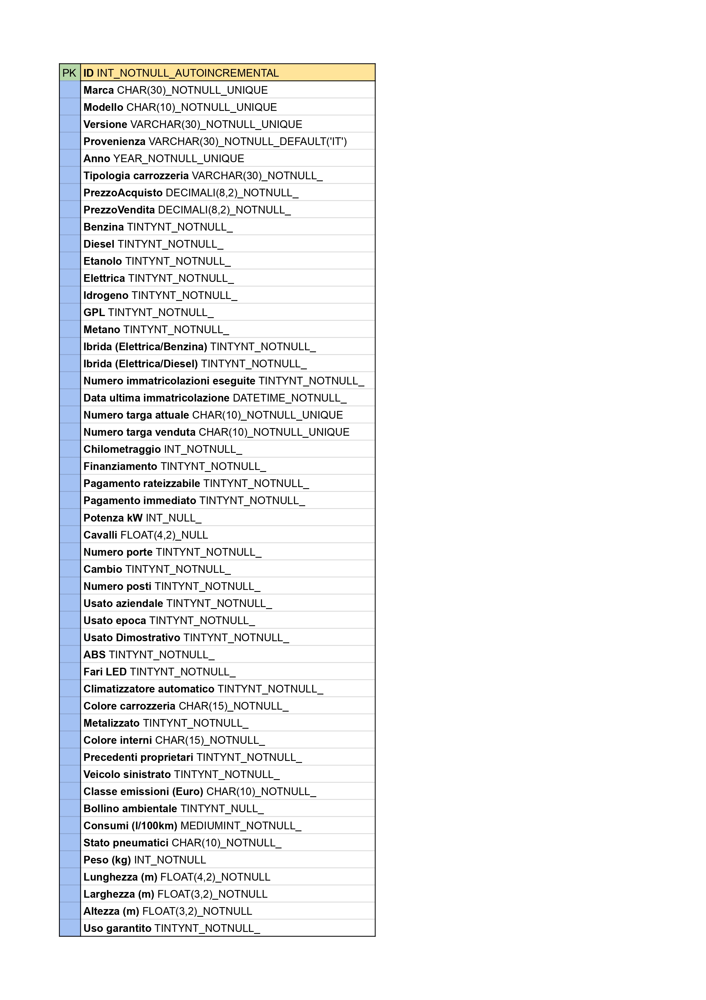

# Database

Creazione di una struttura tabellare coerente per la memorizzazione di tutti i dati riguardanti delle auto usate messe in vendita da un concessionario.

PDF tabella:
;

Considerazioni:
Analizzando la lista delle proprietà delle auto usate in vendita, la maggioranza di attributi hanno come valori restituiti i booleani. 
La parte iniziale della tabella è rappresentata da valori che attribuirei a una classe Veicolo standardizzata poichè nella strutturazione del database ho elencato le prime impressioni di proprietà che mi sono venute in mente.
Con questa struttura tabellare è chiara l'importanza della specificità dei dati.

✨ 18_gennaio 2024